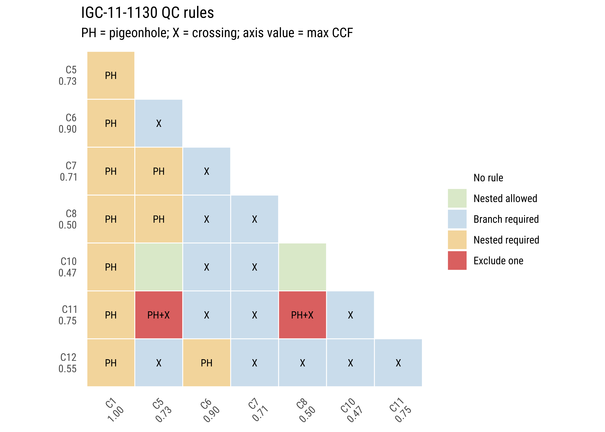
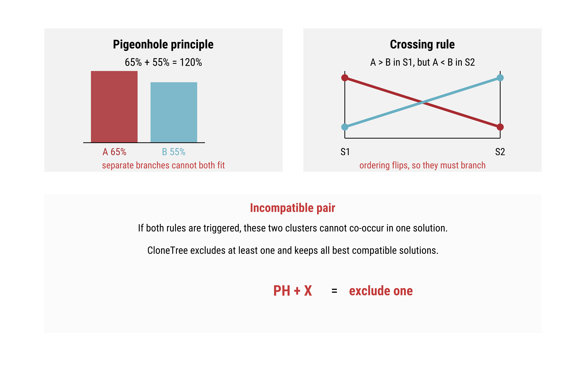
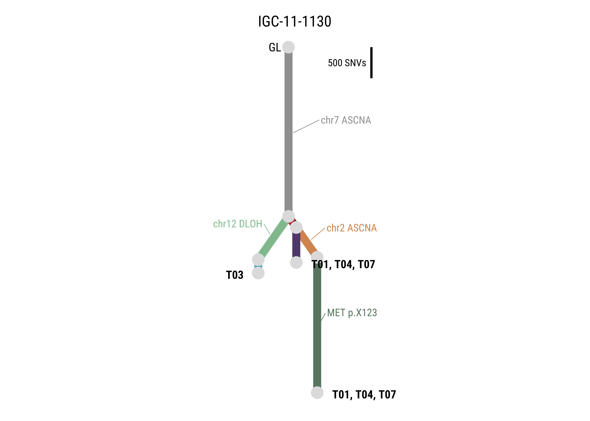
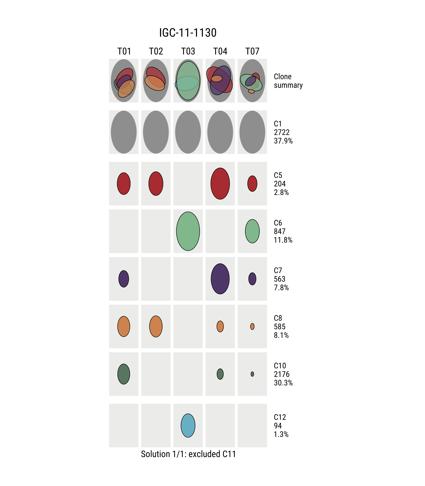

# CloneTree

CloneTree is an R package for clonal evolution QC and visualization from
multi-region sequencing mutation cluster results. It starts from a long table of
cluster-level cancer cell fraction (CCF) estimates and produces:

- rule-based QC using the pigeonhole principle and crossing rule;
- all best compatible cluster-retention solutions when a conflict can be
  resolved in more than one way;
- automatic parent-child clone tree inference from retained clusters;
- publication-style linear phylogenetic trees with branch lengths proportional
  to mutation counts and optional driver/CNA labels;
- Roboto Condensed figure typography when the local font files are available,
  with automatic fallback to the active graphics device font.

The plotting style follows the structure used in Fig. 2 of Zhu, Poeta,
Costantini, Zhang *et al.*, Nature Communications 2020, where trunk and branch
lengths are proportional to substitutions and driver mutations/recurrent SCNAs
are annotated on the tree.

## Installation

From the package directory:

```r
install.packages(c("ggplot2", "ggforce", "ggrepel"))
devtools::install(".")
```

## Input format

The default column names match the original draft package:

| Column | Meaning |
| --- | --- |
| `subject` | tumor or subject ID |
| `sampleID` | region/sample ID |
| `cluster.no` | mutation cluster ID |
| `CCF` | cancer cell fraction, either 0-1 or 0-100 |
| `Clone` | `"Y"` for trunk clusters, `"N"` for subclones |
| `no.of.mutations` | branch length in mutation/substitution counts |

The input must be in long format: one row per tumor region and mutation cluster.
Each cluster should therefore appear once for each sequenced region of the same
subject. Different column names can be supplied to `as_clonetree_input()` or
`clone_qc()`.

Before running the example, inspect the bundled input table:

```r
data(cluster_data_ind2)

unique(cluster_data_ind2$subject)
```

```text
[1] "IGC-11-1130"
```

```r
head(
  cluster_data_ind2[, c(
    "subject", "sampleID", "cluster.no", "CCF", "Clone", "no.of.mutations"
  )],
  10
)
```

```text
# A tibble: 10 x 6
   subject     sampleID        cluster.no      CCF Clone no.of.mutations
   <chr>       <chr>           <chr>         <dbl> <chr>           <dbl>
 1 IGC-11-1130 IGC-11-1130-T01 1          0.973    Y                2722
 2 IGC-11-1130 IGC-11-1130-T01 10         0.473    N                2176
 3 IGC-11-1130 IGC-11-1130-T01 6          0.000720 N                 847
 4 IGC-11-1130 IGC-11-1130-T01 8          0.477    N                 585
 5 IGC-11-1130 IGC-11-1130-T01 7          0.390    N                 563
 6 IGC-11-1130 IGC-11-1130-T01 11         0.000738 N                 433
 7 IGC-11-1130 IGC-11-1130-T01 5          0.511    N                 204
 8 IGC-11-1130 IGC-11-1130-T01 12         0        N                  94
 9 IGC-11-1130 IGC-11-1130-T02 1          1        Y                2722
10 IGC-11-1130 IGC-11-1130-T02 10         0.00218  N                2176
```

If you keep a larger local example table, such as `cluster_data_ind`, it should
use the same long-table columns shown above. Keep large example datasets outside
the package repository unless they are intentionally released with the package.

## Basic Workflow

```r
library(CloneTree)

data(cluster_data_ind2)

qc <- clone_qc(
  cluster_data_ind2,
  subject = "IGC-11-1130",
  ccf_tolerance = 0.03
)

qc_solutions(qc)
plot_clone_qc(qc)
plot_qc_rules_guide()
plot_clone_ccf(qc, solution = 1, clonesum = TRUE)

tree <- infer_clone_tree(qc, solution = 1)
plot_clone_tree(tree)
```

Expected QC solution for the bundled example:

```text
  solution score                     retained excluded
1        1  7191 C1, C5, C6, C7, C8, C10, C12      C11
```

In the bundled example, `C11` is excluded because it has incompatible
pigeonhole-plus-crossing relationships with `C5` and `C8`.

`plot_clone_qc()` prints the cluster-level CCF summary directly under each
cluster name on the matrix axes. `plot_qc_rules_guide()` creates a compact
illustration of the two rules for methods figures or package documentation.

## QC Matrix Legend

The QC matrix summarizes the pairwise evolutionary constraints between mutation
clusters. Matrix-axis labels show the cluster name and the requested CCF summary
value, by default maximum CCF.

| Legend entry | Meaning |
| --- | --- |
| `No rule` | No pigeonhole or crossing constraint was detected for this pair. |
| `Nested allowed` | The CCF profiles are compatible with an ancestor-descendant relationship, but no rule forces it. |
| `Branch required` | The crossing rule is triggered: the relative CCF ordering flips across regions, so the two clusters must be branching subclones if both are kept. |
| `Nested required` | The pigeonhole rule is triggered: the summed CCF exceeds 100% in at least one region, so the two clusters cannot be independent branches if both are kept. |
| `Exclude one` | Both rules are triggered. The pair cannot be nested and cannot be separate branches, so at least one cluster must be excluded from any valid solution. |

Cell text uses compact rule labels:

| Cell label | Meaning |
| --- | --- |
| `PH` | Pigeonhole principle is triggered. |
| `X` | Crossing rule is triggered. |
| `PH+X` | Both rules are triggered; this is an incompatible pair. |

Example QC plot:

```r
plot_clone_qc(qc)
```



Rule guide figure:

```r
plot_qc_rules_guide()
```



## Function Reference

| Function | Purpose |
| --- | --- |
| `as_clonetree_input()` | Standardize a raw multi-region clustering table into the internal CloneTree input object. |
| `clone_qc()` | Apply pigeonhole and crossing constraints, identify incompatible pairs, and enumerate all best retained-cluster solutions. |
| `qc_solutions()` | Return a compact table of retained and excluded clusters for each valid QC solution. |
| `plot_clone_qc()` | Draw the pairwise QC matrix and legend. |
| `plot_qc_rules_guide()` | Draw a simple explanatory figure for the pigeonhole and crossing rules. |
| `plot_clone_ccf()` | Draw oval CCF plots for QC or final retained-clone visualization. |
| `infer_clone_tree()` | Infer a deterministic parent-child clone tree from one QC solution. |
| `layout_clone_tree()` | Compute clone-tree node and edge coordinates before plotting. |
| `plot_clone_tree()` | Draw the final publication-style linear phylogenetic tree with optional driver annotations. |
| `use_clonetree_fonts()` | Enable Roboto Condensed rendering with `showtext` when local font files are available. |
| `oval_clone_QC()` | Legacy wrapper for QC oval plotting. |
| `oval_clone_plot()` | Legacy wrapper for final oval plotting. |
| `tree_base_plot()` | Legacy wrapper for tree plotting. |

## Annotating Driver Events

Provide an event table with one row per cluster annotation. CloneTree accepts
original cluster IDs (`"10"`) or prefixed IDs (`"C10"`).

```r
events <- data.frame(
  subject = "IGC-11-1130",
  cluster.no = c("C1", "C8", "C10"),
  info = c("Truncal driver\nchr7 ASCNA", "chr2 ASCNA", "MET p.X123")
)

plot_clone_tree(tree, events = events)
```

Generic headings such as `Truncal driver` and `Branch event` are omitted from
the tree labels so the figure shows only the driver or CNA text. Region labels
at terminal nodes are bolded, and event labels inherit the color of the clone
branch they annotate.

Example tree plot:



## Oval Clone Plots

`plot_clone_ccf()` and the legacy wrappers use oval areas to represent CCF by
tumor region. The final retained-clone plot can include a clone-summary row,
thin black outlines around retained subclones, and a bottom solution label.

```r
oval_clone_QC(cluster_data_ind2, "IGC-11-1130")
oval_clone_plot(cluster_data_ind2, "IGC-11-1130")
```

Example final oval plot:



## Figure Fonts

CloneTree uses `use_clonetree_fonts()` before saving figures. If `showtext`,
`sysfonts`, and the Roboto Condensed files in
`~/Library/Fonts/RobotoCondensed-*.ttf` are available, figures are rendered with
Roboto Condensed at 600 dpi. Otherwise plots fall back gracefully to the default
graphics-device font.

## Legacy Function Names

The original draft names are kept as wrappers:

```r
oval_clone_QC(cluster_data_ind2, "IGC-11-1130")
oval_clone_plot(cluster_data_ind2, "IGC-11-1130")
tree_base_plot(cluster_data_ind2, "IGC-11-1130")
```

`oval_clone_QC()` draws the original-style QC oval grid with CCF values inside
the ovals. `oval_clone_plot()` draws the retained-cluster final oval plot with a
clone-summary row. For tree inference and rule inspection, use `clone_qc()`,
`infer_clone_tree()`, and `plot_clone_tree()` directly.

## Rule Interpretation

CloneTree treats a pair of clusters as incompatible when:

- their CCF profiles cross across samples, so neither can be a simple ancestor
  of the other; and
- their summed CCF exceeds 100% in at least one sample, so they cannot be
  independent branches in that sample.

When incompatible pairs exist, CloneTree solves a maximum compatible retained
set problem. By default it maximizes retained mutation count; use
`objective = "max_clusters"` to maximize the number of retained clusters.

## Package Checks

The current example package build was verified with:

```text
devtools::test(".")
[ FAIL 0 | WARN 0 | SKIP 0 | PASS 19 ]

devtools::check(".", document = FALSE, manual = FALSE)
0 errors | 0 warnings | 0 notes
```
